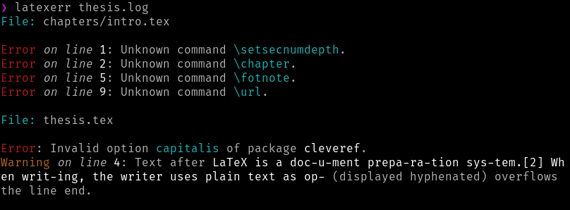

# LaTeXerr

LaTeXerr is a simple command line tool which extracts errors and warnings from LaTeX log file and displays them in a
more readable way. It is implemented in Rust programming language.



## Status

Very few rules are implemented right now. New ones will emerge proportionally to the demand. The error/warning
extraction is also not very robust at the moment, I need to discover as many cases as possible with time. If you want a
new rule to be included or an old one to be fixed, just write an issue or send a pull request (implementation of a rule
is very simple). All contributions are very welcome.

*Be aware that there will likely be many false negatives.*

## Features

* User-friendly error/warning messages
* File name and location in the file
* Colors in terminal
* Support for included documents

## Installation

At the moment, LaTeXerr is not published anywhere apart from GitHub (apparently). You need to clone the repository,
build it from source and link the binary to use it across your system. For that, because I use some experimental
features, you need a **nightly** version of the Rust compiler.

```shell
git clone git@github.com/pnevyk/latexerr.git
cd latexerr
cargo build --release
# link the binary at target/release/latexerr from any of directories in your $PATH
```

## Usage

```shell
pdflatex -interaction=nonstopmode source.tex
latexerr source.log
```

## Rules

*This is a brief list without comments. For rules' description, see the [source
code](https://github.com/pnevyk/latexerr/blob/master/src/rules.rs) or
[tests](https://github.com/pnevyk/latexerr/tree/master/tests/).*

* Undefined control sequence
* Curly braces mismatch
* Sequences invalid outside of math environments
* Underfull and overfull hbox
* Missing package
* Invalid option
* Wrong number of &'s in table and similar environments

If you encounter a LaTeX error which is not handled by LaTeXerr, I would love to hear from you (in the form of issue or
pull request).

## License

LaTeXerr is licensed under [MIT](LICENSE). Feel free to use it, contribute or spread the word.
